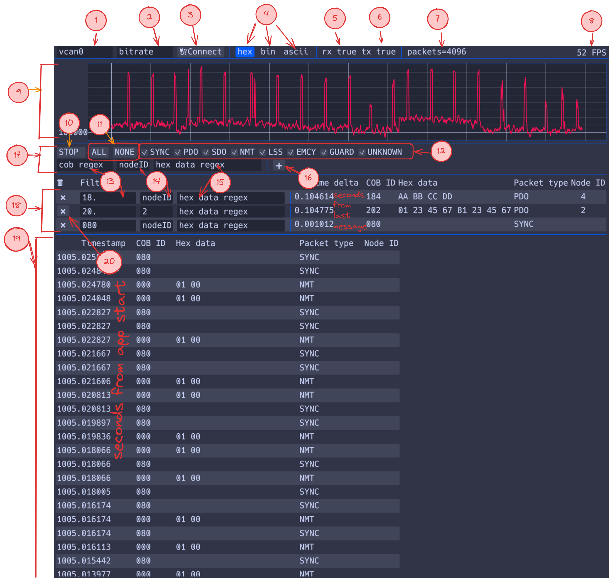

# GUI description



1. Необходимо ввести название интерфейса, с которого будут считываться данные, например `can0`.
2. Можно ввести желаемый битрейт. Если не указан, то ничего не произойдёт, считывание будет работать на битрейте, который был указан ранее. Если установить, то при отличии текущего битрейта от желаемого, интерфейс CAN в Linux будет set link down, затем изменён битрейт, затем set link up.
3. После изменения полей 1 или 2, то нужно нажать эту кнопку для применения изменений.
4. Кнопки выбора формата печати данных пакетов. HEX - шестнадцатиричное представление, bin - двоичное представление, ascii - по возможности преобразовать байты в отображаемые ascii символы, если неудачно, то будет отображена `.`.
5. `rx true`, если подключен принимающий сокет.
6. `tx true`, если подключен отправляющий сокет.
7. Отображается статистика.
8. Отображается FPS интерфейса в отладочных целях
9. График загрузки сети биты в секунду от времени
10. Остановка/запуск чтения пакетов
11. Выбрать все или никакие галочки фильтров.
12. Фильтры по типу пакета. Тип определяется по COB-ID. Если выбрана галочка, то пакеты считываются, иначе игнорируются.
13. Фильтр по шестнадцатиричному представлению COB-ID, поддерживается полноценный regex.
14. Фильтр по nodeID, поддерживается число. Если число установлено, но в данных пакета нет nodeID, то пакет игнорируется.
15. Фильтр по выбранному представлению данных, поддерживается полноценный regex.
16. Закрепить текущий фильтр данных.
17. Настройка фильтров.
18. Закреплённые фильтры
19. Отфильтрованные сообщения, до 4096, можно листать колесом мыши или слайдером.
20. Удалить закреплённый фильтр.

# CLI arguments

```
OZON CanOpenViewer

Usage: oze-canopen-viewer [OPTIONS]

Options:
  -c, --can <CAN>          
  -b, --bitrate <BITRATE>  
  -h, --help               Print help
  -V, --version            Print version
```

Если указан `--can`, то при старте будет указан интерфейс CAN, с которого будут браться данные, иначе нужно будет ввести в GUI.

Если указан `--bitrate`, то при старте будет указан желаемый битрейт интерфейса CAN, иначе, при необходимости нужно будет ввести в GUI.