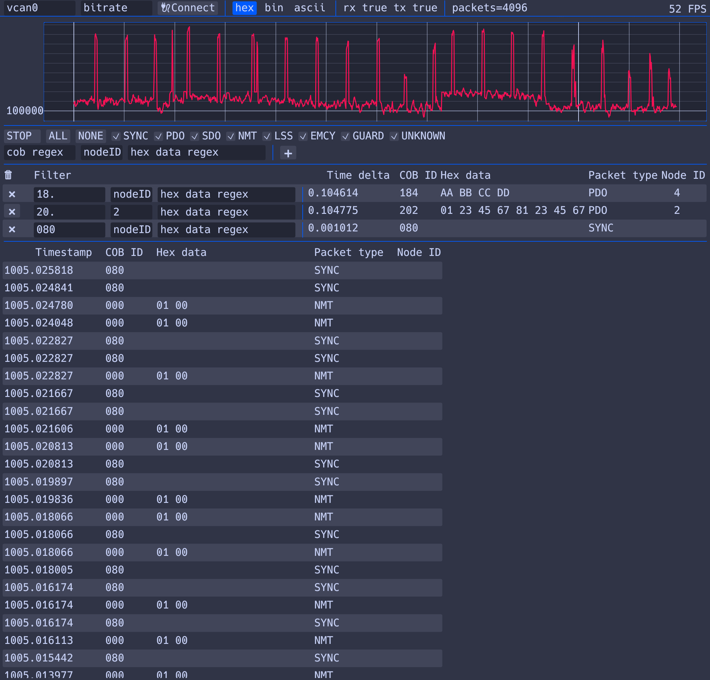

# oze-canopen-viewer
Real-time CanOpen traffic sniffer for Linux with a low latency graphical interface and convenient filters. Compatible only with socket CAN drivers.



# Features:
- Automatic interface configuration when connecting USB-CAN with bitrate configuration.
- CAN bus load graph.
- Parsing and displaying the packet type and corresponding nodeID.
- Global filter by packet types, regex for COB-ID and DATA, and nodeID filter.
- Ability to pin a filter, displaying only the latest message and the time delta between messages. This is useful for convenient PDO tracking.
- Instant switching between data representations: HEX, BIN, ASCII.
- FPS limited only by the hardware (tested with 300 FPS).

# Documentation

[Documentation](doc/description.md) is in `doc/description.md` or `doc/description_ru.md`

# Alternatives
- Wireshark: Formally has all the needed features, but its focus on dump analysis rather than real-time makes it inconvenient for real-time work, e.g., when you need to monitor the contents of packets on two COB-IDs simultaneously.
- [candump](https://github.com/cantools/cantools): A console utility that does not parse CanOpen messages. It has various filters for data and COB-ID, but is not very convenient to use.
- [CanOpenMonitor](https://github.com/robincornelius/CanOpenMonitor): Has no realtime filters over message data.
- Proprietary and paid: `CANopen Magic`, `PCAN-View`

# Build

If you are using Ubuntu 22.04 then you can download precompiled `.deb` file from the releases tab, install it, and use it.

Or build it yourself:

1. Build the application:
```sh
cargo build --release
```
2. Add access to manage the interface:
```sh
sudo setcap cap_NET_ADMIN=ep ./target/release/oze-canopen-viewer
```
3. Launch:
```sh
./target/release/oze-canopen-viewer
```
4. Enter the `can name` and `bitrate` if needed, then click `Connect`.

You can also run it without setcap. To do this, start the program, enter the interface name, click `Connect`, and then execute:
```sh
sudo ip link set can0 up type can bitrate 100000
sudo ifconfig can0 txqueuelen 1000
sudo ip link set can0 up
```

You can hover element and get documentation.

# Testing
Unit tests are in `src/` and has no external requirements, you can run it using `cargo test`. Gui code doesn't have automated testing.

Integration tests are in `tests/`. To run it successfully you need:
1. Create virtual CAN interface:
- `sudo modprobe vcan`
- `sudo ip link add dev vcan0 type vcan`
- `sudo ip link set up vcan0`
2. Run `cargo test -- --test-threads 1`

After that you can check code coverage using `cargo tarpaulin -j 1 --engine llvm`

# Rust Docs
To generate rustdocs you need to execute
```
cargo doc
```

# License
```
   Copyright © 2024 LLC "Ozon Technologies"

   Licensed under the Apache License, Version 2.0 (the "LICENSE");
   you may not use this file except in compliance with the License.
   You may obtain a copy of the License at

       http://www.apache.org/licenses/LICENSE-2.0

   Unless required by applicable law or agreed to in writing, software
   distributed under the License is distributed on an "AS IS" BASIS,
   WITHOUT WARRANTIES OR CONDITIONS OF ANY KIND, either express or implied.
   See the License for the specific language governing permissions and
   limitations under the License.
```